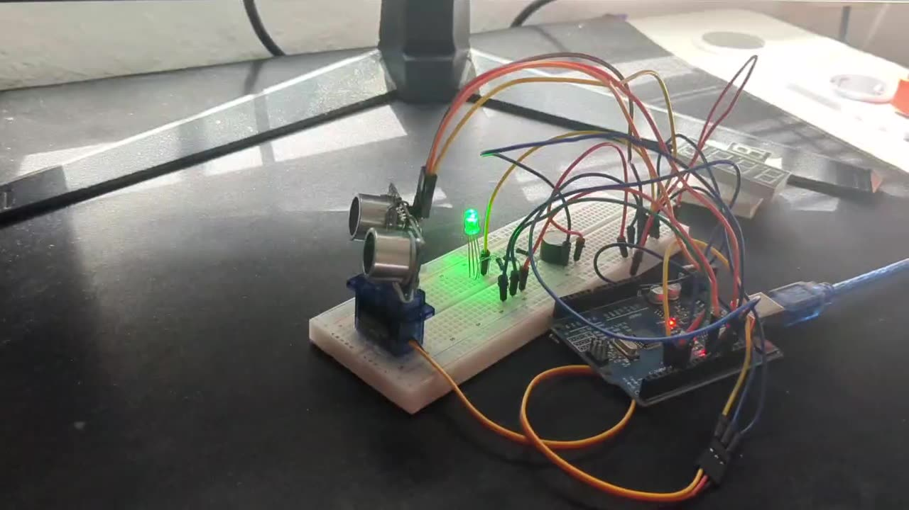
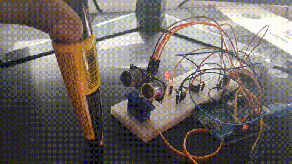

# Sonar Radar – Ultraschallbasierte Abstandsmessung mit Arduino

Ultraschall-Radar-Prototyp: ein HC-SR04-Sensor wird per Servo über einen
Bereich von 0° bis 180° geschwenkt und misst bei jedem Winkelschritt den
Abstand zu Objekten. Eine RGB-LED und ein Buzzer geben eine optische bzw.
akustische Rückmeldung, abhängig davon, wie nah ein Objekt ist.



```
   Ultraschallsensor (HC-SR04)
              │
              ▼
      Abstandsmessung (pulseIn)
              │
              ▼
     Arduino berechnet Abstand
              │
   ┌──────────┼──────────┐
   ▼          ▼          ▼
 RGB-LED    Buzzer      Servo (0°→180°→0°)
              │
              ▼
     Serial-Ausgabe (Winkel, Abstand)
```

## Hardware

| Komponente                  | Funktion                                   |
|------------------------------|---------------------------------------------|
| Arduino Uno                  | Steuerung                                    |
| HC-SR04 Ultraschallsensor     | Abstandsmessung (Trigger/Echo)              |
| Servomotor (SG90)             | Schwenkt den Sensor 0°–180°                 |
| RGB-LED                       | Optische Abstandsanzeige                    |
| Buzzer (passiv)               | Akustische Abstandsanzeige                  |
| Breadboard + Jumperkabel       | Verkabelung                                  |

### Pinout

| Signal          | Arduino Pin |
|------------------|-------------|
| HC-SR04 Trig     | D10         |
| HC-SR04 Echo     | D13         |
| Servo Signal     | D3          |
| Buzzer           | D9          |
| LED Rot          | D4          |
| LED Grün         | D5          |
| LED Blau         | D6          |

## Funktionsweise

1. Der Servo fährt schrittweise von 0° auf 180° und wieder zurück.
2. Bei jedem Winkel sendet der HC-SR04 einen Ultraschallimpuls; die
   Laufzeit wird über `pulseIn()` gemessen.
3. Der Abstand wird berechnet über:

   ```
   d[cm] ≈ t[µs] × 0.017
   ```

   (Herleitung: d = t·c/2, mit Schallgeschwindigkeit c ≈ 343 m/s;
   durch 2 geteilt, weil das Signal die Strecke hin und zurück läuft.)

4. Je nach gemessenem Abstand:
   - **> 40 cm** → LED grün, Buzzer aus (freier Bereich)
   - **10–40 cm** → LED gelb, Buzzer leiser Ton (Warnbereich)
   - **< 10 cm** → LED rot, Buzzer lauter Ton (Objekt nah)
5. Jeder Messpunkt (Winkel, Abstand) wird zusätzlich über die serielle
   Schnittstelle (9600 Baud) ausgegeben, um die Daten später z. B. in
   MATLAB auszuwerten.

## Verbesserungen gegenüber der ersten Version

- Ungenutzte Variable `pot` (A0) entfernt.
- Duplizierten Messblock aus den beiden `for`-Schleifen in die Funktionen
  `scanStep()`, `measureDistanceCm()`, `updateIndicators()` und
  `setColor()` ausgelagert.
- `Serial.begin(9600)` + `Serial.print()` ergänzt, um Winkel/Abstand als
  CSV-Zeilen (`winkel_deg,abstand_cm`) auszugeben.
- Trigger-Timing an das HC-SR04-Datenblatt angepasst
  (`delayMicroseconds(2)` statt `delay(10)` vor dem Trigger-Puls).

## Verwendung

1. Sketch in der Arduino IDE öffnen (`src/sonar_radar.ino`), Library
   `Servo` ist im Arduino-Core enthalten.
2. Board/Port wählen, hochladen.
3. Seriellen Monitor oder Serial Plotter bei 9600 Baud öffnen, um die
   Live-Messwerte zu sehen.
4. Für eine Messreihe: seriellen Monitor als `.csv` loggen (z. B. mit
   dem Arduino IDE Serial Monitor "Save" oder einem Tool wie
   [CoolTerm](https://freeware.the-meiers.org/)) und die Datei unter
   `data/` ablegen.

## Nächste Schritte

- [ ] MATLAB-Auswertung der geloggten Daten (`matlab/`): Mittelwert,
      Standardabweichung, Sensorcharakteristik, Polardarstellung
      Winkel vs. Abstand.
- [ ] PCB-Version des Aufbaus in KiCad (`pcb/`), um die Verkabelung vom
      Breadboard auf eine Platine zu übertragen.

## Video



## Lizenz

Privates Lernprojekt.
